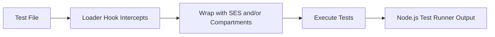

# cenobite

> A proof-of-concept test runner demonstrating SES Compartment isolation for secure test execution

## What is Cenobite?

Cenobite is an experimental test runner built on top of [`node:test`](https://nodejs.org/api/test.html) leveraging [SES (Secure EcmaScript)](https://github.com/endojs/endo/tree/master/packages/ses) to provide **isolated, secure test execution**. It serves as a proof-of-concept demonstrating the applicability of `Compartment`s to the test-runner use case.

## Why Cenobite?

If a test runner executes all tests in a shared global environment, that environment is prone to being polluted—whether that's globals or shared state. Most test runners solve this problem by executing test files in separate processes; `node:test` is no different. This is effective, but slow.

With the _awesome power_ of SES, Cenobite can run all test files in a **single process** while avoiding these problems. By default, Cenobite uses SES' `lockdown` to freeze the intrinsic globals, preventing code from modifying built-in globals and their prototypes.

Optionally, Cenobite can isolate each test file (and every package it needs) into its own `Compartment`. This eliminates the possibility of shared global state leaking between tests—all while running in a single process.

## How It Works

Cenobite uses **Node.js loader hooks** to intercept test file loading and automatically wrap them with SES compartment initialization:



## Installation

```bash
npm install cenobite -D
```

## Usage

You can run `cenobite` like you would run `node --test`:

```bash
# Run tests with SES protection
cenobite test/**/*.test.js

# Enable verbose output
cenobite --verbose test/**/*.test.js

# Use different reporters (spec, tap, dot, junit)
cenobite --reporter tap test/**/*.test.js
cenobite --test-reporter junit test/**/*.test.js

# Enable full compartment isolation (experimental)
cenobite --isolate test/**/*.test.js
```

**Note**: While Node.js's test runner provides isolation by running each test file in a separate process, Cenobite with `--isolate` provides compartment-based isolation within the same process, which can be more efficient and provide finer-grained control.

### Environment Variables

- `CENOBITE_DEBUG=1` - Enable detailed debug logging

## Technical Implementation

### Loader Hooks Architecture

Cenobite uses Node.js's [module customization hooks](https://nodejs.org/api/module.html#customization-hooks) to transform test files during the loading process:

1. **Detection**: Identifies test files by pattern (`*.test.*`, `/test/` directory)
2. **Transformation**: Injects SES initialization code before the original test content
3. **Execution**: Test runs with SES protections active
4. **Reporting**: Full compatibility with Node.js test runner and all reporters

> "Full" compatibility is aspirational. Buyer beware.

### Lockdown Configuration

Cenobite uses development-friendly SES settings:

```javascript
lockdown({
  errorTaming: 'unsafe', // Better error messages
  stackFiltering: 'verbose', // Detailed stack traces
  evalTaming: 'unsafe', // Allow eval for testing
  overrideTaming: 'severe', // Strong prototype protection
});
```

### Source Maps Support

Full source map support is enabled by default, ensuring error traces point to your original test files.

## Compatibility

- **Node.js**: 20.19.0+
- **Test Framework**: Node.js built-in test runner
- **Reporters**: All Node.js test reporters (spec, tap, dot, junit)
- **ES Modules**: Full ESM support
- **TypeScript**: Works with `tsx` or compiled JS

## Project Status

🚧 **Experimental / Proof of Concept**

This project demonstrates the potential of SES Compartments for test isolation but is not yet production-ready. It serves as:

- A proof-of-concept for compartment-based test runners
- A research vehicle for secure test execution patterns
- A foundation for future hardened testing tools

## "Cenobite"?

Monks. Ascetics who live in solitude, often in monasteries. The name reflects the idea of isolation and discipline, much like how Cenobite aims to isolate test environments securely. _And that's the truth._

## Related Projects

- [SES (Secure EcmaScript)](https://github.com/endojs/endo/tree/master/packages/ses) - The security foundation
- [@endo/compartment-mapper](https://github.com/endojs/endo/tree/master/packages/compartment-mapper) - Module isolation system
- [Hardened JavaScript](https://hardenedjs.org) - Learn more about secure JavaScript

## Contributing

This is an experimental project. [Contributions](./CONTRIBUTING.md), ideas, and feedback are welcome!

## License

Copyright © 2025 Christopher Hiller. Licensed under [BlueOak-1.0.0](https://blueoakcouncil.org/license/1.0.0).
